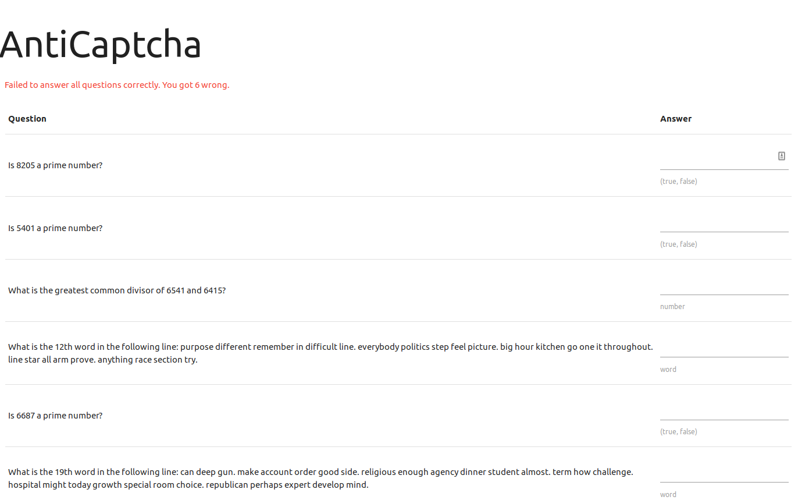

I tried out IceCTF this past week. From their website: “IceCTF is a computer security contest targeted at anyone with an interest in computer science. The game consists of a series of challenges where participants must reverse engineer, break, hack, decrypt, or do whatever it takes to solve the challenge. The challenges are all set up with the intent of being hacked, making it a great way to get some hands-on experience.” It’s based in Iceland and hosted on the crisp Adversary security training platform.

I found out about it through NSL here in Los Angeles. Luckily, someone on their IRC invited me to collaborate with them. It was pretty fun, and it felt good to dust off CTF skills that I started developing this year.

Here is a write up on the miscellaneous challenge “AntiCaptcha”

Upon visiting the webpage, you are presented with ~1000 questions, which seem to be all be questions that a bot could in fact answer. At first it seemed like there were only 3 question patterns: “Is X a prime number?”, “What is the greatest common divisor of X and Y?”, and “What is the Nth word in the following line: apple jelly carrot...”.

I started off by trying to answer one and seeing what would happen.

Upon submitting a single correct answer, the page replied with “Failed to answer all questions correctly. You got 6 wrong.” In fact, solving three or four problems didn’t budge the amount I got wrong (unless I actually got one wrong, in which case it would say I got 7 wrong).

So, I got to work. My plan was to write a python script. The script would parse the HTML using Beautiful Soup, find all the questions, figure out which of the three questions was being asked, extract the variable to do some computation, and append it to a list of answers I would send back in a POST request.

However, my script crashed when trying to identify which question it was presented with. I printed out the input that was crashing it.

“Who directed the movie Jaws?”

 My assumption that there were only three question patterns turned out to be wrong. I tried answering it, but to my dismay, it still said I got six wrong. So, I hardcoded a reply to that question (Steven Spielberg, in case you were wondering). And then, it crashed again. This time the question was “What is the capital of Hawaii?” I put in “Honolulu”, submitted it, and ...

 

 I only got 5 wrong! A bit less wrong is alright with me!

So, I modified my script to print out the oddball questions and keep going. It spit out ten or twelve questions. I figured out which ones actually decremented the amount I got wrong, answered them, and got the flag!

